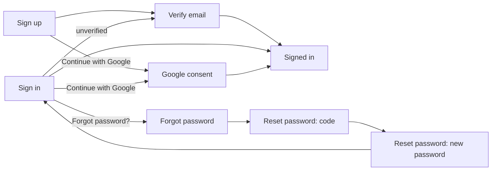

# Design — Authentication

> **Approved** by @user on 2026-09-14. Locked — changes require a change record (§7).

Context: [PRD](./01-prd.md)
Canvas: https://claude.ai/code/artifact/cf42d1ad-daaf-45d8-9910-001c606fdf5c
Exports: `./assets/canvas/`

## 1. Design intent

Signing in should feel like the front door of the same house, not a different
product bolted on. Every screen reuses 001's warm-paper system exactly: the
same wordmark, the same card, input and button shapes, the same three type
families. The one new idea is the six-box code entry, used identically for
signup verification and for password reset so a returning user only learns it
once. Added 2026-09-14: a Google button sits above the manual form on Sign up
and Sign in, and every screen that can be abused (repeated signups, repeated
wrong passwords or codes) now has its own rate-limited state, styled like the
existing blocked state rather than as another red error. Also added: every
screen carries a fine, near-static dot-grid texture behind the card, with a
vignette that fades it out toward the center, so the card stays the readable
part of the page. Chosen from six drafted directions (a drifting gradient, this
grid, an animated line pattern, drifting slash marks, an animating knowledge
graph, and an "agent at work" motif) on the same canvas.

## 2. Screen inventory

| Screen | Purpose | Serves | Canvas artboard |
|---|---|---|---|
| Sign up | Collect username, email, password, or continue with Google | FR-1 to FR-3, FR-15, FR-16, FR-19, FR-20 | `Main` |
| Verify email | Enter the 6-digit code, resend it, see wrong/expired/locked errors | FR-4 to FR-7, FR-18 | `VerifyOTP` |
| Sign in | Email and password or Google, generic failure, unverified routing, lockout | FR-9 to FR-11, FR-15 to FR-17, FR-20 | `SignIn` |
| Forgot password | Start a reset by email, enumeration-safe confirmation | FR-12, FR-19 | `ForgotPassword` |
| Reset password | Same code entry, then a new-password form, lockout on the code step | FR-13, FR-14, FR-18 | `ResetPassword` |
| Sign up, mobile | Sign up at 390x844, Google button included | FR-1 to FR-3, FR-15 | `MobileSignUp` |
| Verify email, mobile | Code entry at 390x844 | FR-4 to FR-7 | `MobileVerifyOTP` |
| Sign in, mobile | Sign in at 390x844, Google button included | FR-9 to FR-11, FR-15 | `MobileSignIn` |

Each desktop artboard carries a `state` tweak chip (and `VerifyOTP` /
`ResetPassword` a second one) that switches the states in §4 in place, rather
than one artboard per state. Mobile artboards show one representative state
each, matching 001's mobile artboards.

### Dark theme

`DarkMain`, `DarkVerifyOTP`, `DarkSignIn`, `DarkForgotPassword`,
`DarkResetPassword`, `DarkMobileSignUp`, `DarkMobileVerifyOTP`,
`DarkMobileSignIn` reuse 001's own dark tokens exactly (the same values as
`DarkCommandPalette.dc.html`), not a new palette. The dot-grid background and
the Google button get dark-specific treatments: a darker dot color, and the
button's white surface swapped for a dark one with light text, since a plain
white "Continue with Google" button would fight the dark page around it.
Same status as 001's own dark screens: drawn for reference, no dark-theme FR
exists in the PRD, matching 001's own decision not to add one (its Q13).

## 3. Flows

| Flow | Entry | Steps | Exit | Serves |
|---|---|---|---|---|
| Sign up and verify | Sign up | Fill the form, submit, land on Verify email, enter the code | Signed in | FR-1 to FR-8 |
| Sign in | Sign in | Email and password, submit | Signed in, or routed to Verify email if unverified | FR-9 to FR-11 |
| Forgot password | Sign in, "Forgot password?" | Forgot password screen, enter email, submit, see the confirmation | Reset password (code step) | FR-12 |
| Reset password | Reset password, code step | Enter the code (reuses the Verify email input), continue, set a new password | Sign in, with the new password | FR-13, FR-14 |
| Google sign-in | Sign up or Sign in, "Continue with Google" | Google's own consent screen, then back to Slashit. An email matching an existing manual account signs into it (FR-20), no extra screen | Signed in, password and code both skipped | FR-15, FR-16, FR-20 |

## 4. States

### Sign up (`Main`)

| State | What the user sees | Copy |
|---|---|---|
| Empty | The Google button, a divider, then the form, no values entered | Placeholder text in each field |
| Loading | Primary button shows a spinner, disabled | "Creating account…" |
| Error | Red banner above the form, the offending field outlined red | "That email is already registered. Sign in instead." (email taken); username-taken uses the same banner and field treatment |
| Success | Form replaced by a confirmation card | "Account created. Taking you to verify your email next." |
| No permission | N/A. Nobody is signed in yet, so there is nothing to be denied | — |
| Rate limited (FR-19) | Form replaced by an amber card | "Too many attempts. Too many accounts have been created from this address recently. Try again in a few minutes." |

### Verify email (`VerifyOTP`)

| State | What the user sees | Copy |
|---|---|---|
| Empty | Six empty code boxes | "We sent a 6-digit code to {email}" |
| Loading | Primary button shows a spinner, disabled | "Verifying…" |
| Error, wrong code | Red banner, all six boxes outlined red, resend still on cooldown | "That code is not right. Check it and try again." |
| Error, expired code | Red banner, boxes outlined red, resend is now active | "This code expired. Request a new one below." |
| Success | Card replaced by a confirmation | "Email verified. Taking you into Slashit now." |
| No permission | N/A | — |
| Rate limited (FR-18) | Boxes and banner replaced by an amber card | "Too many attempts. This code is now blocked. Request a new one in 15 minutes." |

### Sign in (`SignIn`)

| State | What the user sees | Copy |
|---|---|---|
| Empty | The Google button, a divider, then the form, no values entered | Placeholder text in each field |
| Loading | Primary button shows a spinner, disabled | "Signing in…" |
| Error | Red banner, identical wording whether the email exists or not (FR-11) | "That email or password is not right." |
| Success | Form replaced by a confirmation card | "Signed in" |
| No permission (blocked) | Form replaced by an amber card, then routes to Verify email | "Verify your email first. Taking you to the verification step." |
| Rate limited (FR-17) | Form replaced by a separate amber card, distinct from the unverified one | "Too many attempts. This account is locked for 15 minutes after too many failed sign-ins." |

### Forgot password (`ForgotPassword`)

| State | What the user sees | Copy |
|---|---|---|
| Empty | The email field, empty | Placeholder text |
| Loading | Primary button shows a spinner, disabled | "Sending…" |
| Error | Red banner, field outlined red. Format only, never "no account with that email" (would leak enumeration) | "Enter a valid email address." |
| Success | Form replaced by a confirmation card, deliberately non-committal | "If an account exists for that address, we have sent a code to reset the password." |
| No permission | N/A | — |
| Rate limited (FR-19) | Form replaced by an amber card | "Too many requests. Too many reset requests for this address. Try again in a few minutes." |

### Reset password (`ResetPassword`)

Two steps, each with its own states; `step` (code / password) is a separate
tweak from `state`.

| State | What the user sees | Copy |
|---|---|---|
| Empty, code step | Six empty code boxes | "We sent a 6-digit code to {email}" |
| Empty, password step | New-password and confirm fields | "Email verified. Choose a new password for your account." |
| Loading | Primary button shows a spinner, disabled | "Checking…" / "Saving…" |
| Error | Red banner on the code step. One message for both wrong and expired, since a reset code is single-use either way (NFR-2) | "This code is wrong or has expired. Request a new one." |
| Success | Card replaced by a confirmation | "Password changed. Sign in with your new password." |
| No permission | N/A | — |
| Rate limited (FR-18), code step only | Code entry replaced by an amber card | "Too many attempts. This code is now blocked. Request a new one in 15 minutes." |

## 5. Responsive behaviour

| Breakpoint | Layout change |
|---|---|
| Mobile (390px) | Card loses its outer centering wrapper and becomes the full-width column, padded 22px; see `MobileSignUp`, `MobileVerifyOTP`, `MobileSignIn` |
| Tablet | No distinct layout. The 400px card centers on any width above mobile; nothing about a tablet viewport changes it |
| Desktop | The 400px card centers in the 1440px frame, as drawn |

## 6. Design system deltas

| Change | Kind | Token or component | Why existing one does not fit |
|---|---|---|---|
| Auth card layout (`.authwrap`, `.authcol`, `.authcard`) | added | component | 001 has no pre-authentication, centered single-card layout; every existing screen sits inside the app rail |
| Six-box code input (`.otprow`, `.otpbox`) | added | component | New interaction, not covered by any existing input style |
| Status badges (`.checkcircle`, `.amberwarn`) | added | component | 001 has no full-card success/warning confirmation state; its `.pill` is inline, too small for this moment. `.amberwarn` now covers both the unverified-account and the rate-limited states |
| Google button and divider (`.gbtn`, `.divider`) | added | component | Google's own button convention (white surface, its own four-color mark, "Continue with Google"), not one of 001's existing button variants |
| Page background (`.vign`, `body`'s dot-grid) | added | token/component | 001's canvas is always flat `--paper`; the auth pages are the first surface with no app rail around them, and stand to lose nothing from a bit of depth behind the card |
| Dark theme | reused | tokens | Same values as `001-capture-and-records-foundation/assets/canvas/DarkCommandPalette.dc.html`; the Google button and dot color get dark-specific patches on top |
| Error banner (`.note.err`) | reused | component | Already defined in 001's canvas; used as-is |
| Button, input, color and type tokens | reused | tokens | Pulled directly from `001-capture-and-records-foundation/assets/canvas/CommandPalette.dc.html`, unchanged |

## 7. Accessibility

| Area | Decision |
|---|---|
| Contrast | Unchanged from 001: `--ink` on `--paper`/`--surface` and `--red`/`--green`/`--amber` text on their wash backgrounds, already meeting the ratios that system was built to |
| Keyboard path | Label, then field, then primary action, top to bottom on every screen. The six code boxes are one stop each, in order, with auto-advance to the next box on input |
| Screen reader labels | Each code box needs `aria-label="Digit N of 6"`; the resend action needs its cooldown state announced (`aria-live="polite"`) so a screen-reader user hears when it becomes available. Neither is drawn in the static mockup; carried to the build plan |
| Motion and reduced motion | The button spinner is the only motion. Under `prefers-reduced-motion`, it is replaced by static loading text, no spin |
| Focus order | On entering Verify email or Reset password's code step, focus starts in the first code box |
| Google button | Opens Google's own consent screen in the same tab; on return, focus must land on the page's main heading, not reset to the top of an empty form. Not verifiable in a static mockup, carried to the build plan |

## 8. Copy

| Location | Text | Notes |
|---|---|---|
| Sign up, error | "That email is already registered. Sign in instead." | Username-taken uses "That username is taken." in the same banner |
| Verify email, wrong code | "That code is not right. Check it and try again." | |
| Verify email, expired code | "This code expired. Request a new one below." | |
| Sign in, error | "That email or password is not right." | Deliberately identical for both causes, per FR-11 |
| Sign in, blocked | "Verify your email first. Taking you to the verification step." | Transient, before the redirect |
| Forgot password, success | "If an account exists for that address, we have sent a code to reset the password." | Deliberately non-committal, same enumeration reasoning as FR-11 |
| Reset password, error | "This code is wrong or has expired. Request a new one." | One message for both causes |
| Sign up / Sign in, Google button | "Continue with Google" | Not "Sign in with Google"; same label whether the account is new or existing, since FR-15 does not distinguish them |
| Sign up, rate limited | "Too many attempts. Too many accounts have been created from this address recently. Try again in a few minutes." | |
| Sign in, rate limited | "Too many attempts. This account is locked for 15 minutes after too many failed sign-ins." | Distinct card from the unverified-account one, same visual treatment |
| Verify email / Reset password, rate limited | "Too many attempts. This code is now blocked. Request a new one in 15 minutes." | Same copy in both places, one component |
| Forgot password, rate limited | "Too many requests. Too many reset requests for this address. Try again in a few minutes." | |

## 9. Open questions

| # | Question | Owner | Answer |
|---|---|---|---|
| Q2 | Exact `aria-label` and `aria-live` wording for the code boxes and resend action (§7) | user, build plan | Open |
| ~~Q3~~ | Does a Google sign-in on an email with an existing manual account merge with it, or get refused? | user, build plan | **Answered 2026-09-14.** Merges with it (FR-20). No new screen: the Google button just signs the user into whichever account it resolves to. |
| ~~Q4~~ | Are the 5-attempt / 15-minute lockout numbers shown on the rate-limited screens (§4, §8) acceptable, or should the copy change to match different thresholds? | user, build plan | **Answered 2026-09-14.** The numbers stand as drawn. |
| ~~Q5~~ | Which background direction for the auth pages (§1, §6)? | user | **Answered 2026-09-14.** Direction B, the fine dot-grid texture with a vignette. |

Q2 (`aria-label`/`aria-live` wording) remains open.

## Change log

| Date | Change | Why | Approved by |
|---|---|---|---|
| 2026-09-14 | Created | Drafted after PRD approval, using Claude Design against the PRD's FRs and 001's existing canvas tokens | pending |
| 2026-09-14 | Google sign-in added to Sign up and Sign in (desktop and mobile): a button, a divider, screen inventory, flow, copy and an accessibility note. A "rate limited" state added to Sign up, Sign in, Verify email, Forgot password and Reset password, styled like the existing amber blocked card. Q1 dropped, no longer needed; Q3 and Q4 opened, carried from the amended PRD | User asked for Google sign-in and rate-limit error cases, and said the radius-app reference is no longer needed | user |
| 2026-09-14 | Six background directions drafted on the canvas; Direction B, a fine dot-grid texture with a vignette, applied to every screen (desktop and mobile). Design intent and a design-system delta updated. Q5 opened and answered in the same change | User asked for the auth pages to look more modern, tied to Slashit and the personal-agent framing | user |
| 2026-09-14 | Q3 answered: Google sign-in merges into a matching manual account (FR-20), no new screen needed. Q4 answered: the rate-limit numbers stand. Screen inventory and Google-flow row updated to cite FR-20 | User answered both build-plan-blocking questions | user |
| 2026-09-14 | Eight dark-theme artboards added, reusing 001's dark tokens exactly. §2 and §6 updated; no PRD change, same as 001's own decision not to formalize a theme-toggle FR | User asked for dark theme designs | user |
| 2026-09-14 | Approved | User approved, proceed to build plan | user |
